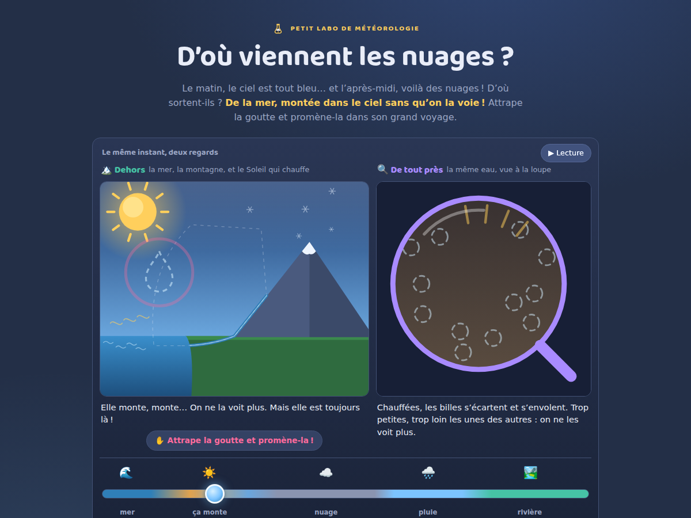
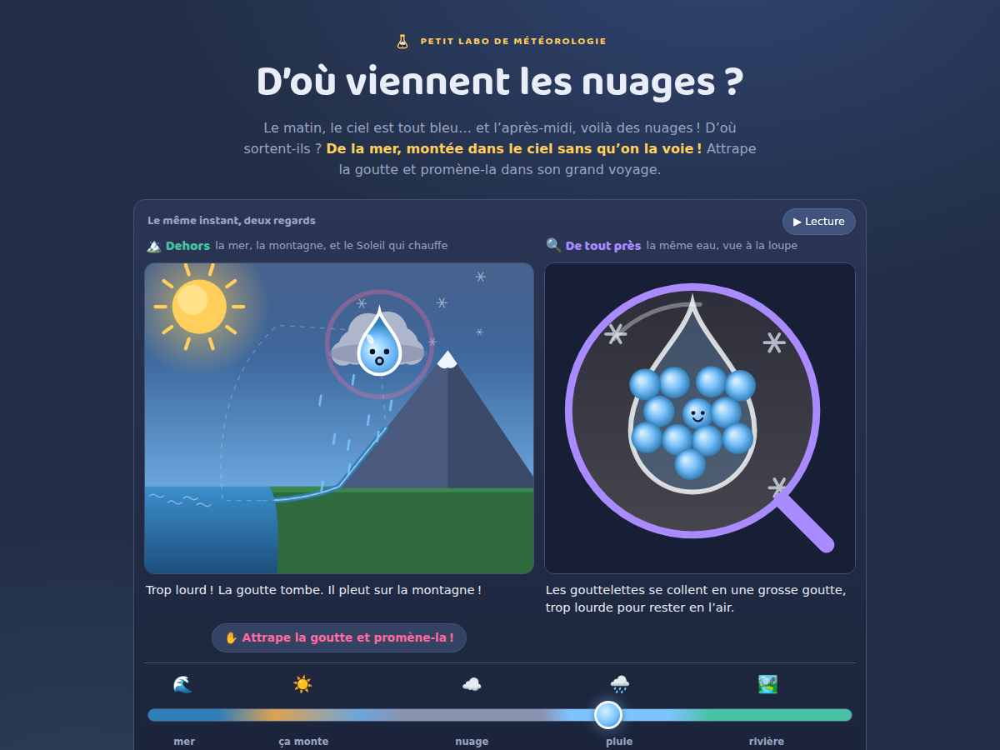

# D'où viennent les nuages ?

**Petit labo de météorologie** — un site d'une page, en français, qui explique
d'où viennent les nuages à un enfant d'environ 5 ans. Le parent lit à voix
haute ; l'enfant attrape une goutte d'eau et la promène dans son grand voyage :
la mer, le ciel, le nuage, la pluie, la rivière… et la mer à nouveau.

En ligne : **<https://petit-labo.fr/d-ou-viennent-les-nuages/>**

L'idée centrale, celle que l'enfant doit retenir :

> Un nuage, c'est de l'eau de la mer montée dans le ciel sans qu'on la voie.
> L'eau ne disparaît jamais : elle tourne en rond, toujours la même.

| La goutte s'envole | Il pleut sur la montagne |
|---|---|
|  |  |

C'est le premier épisode de la série météorologie : son thème graphique (le
ciel d'un jour de pluie, l'accent bleu de la goutte, l'or de la famille pour la
chaleur du Soleil) est celui de la série.

## Fonctionnalités

- **Le geste-signature** : attraper la goutte et la promener le long de son
  chemin en pointillés, dans un sens ou dans l'autre. Le paysage, lui, ne bouge
  jamais : la mer à gauche, la montagne enneigée à droite, le Soleil fixe en
  haut à gauche au-dessus de la mer qu'il chauffe.
- **Le moment magique** : chauffée par le Soleil, la goutte s'envole… et
  **disparaît** — elle est toujours là, sous le doigt (un pointillé la suit), et
  elle réapparaît dans le froid, tout en haut, pour faire un nuage avec ses
  copines. Puis le nuage, trop lourd, pleut sur la montagne, et la rivière
  ramène la goutte à la mer.
- **La loupe « De tout près »**, toujours synchronisée : douze billes d'eau
  serrées dans la mer, éparses et effacées dans la vapeur, regroupées en trois
  gouttelettes dans le nuage, collées en une grosse goutte dans la pluie — la
  première bille, c'est elle, elle a le même sourire.
- **La lecture automatique** : le voyage avance tout seul (un tour en ~85 s),
  bouton ⏸/▶ — et tout geste de l'enfant la met en pause.
- **Les quatre boutons-moments** « 🎲 Joue avec la goutte » : la goutte glisse
  en douceur jusqu'au moment choisi, toujours dans le sens du voyage, puis la
  micro-histoire raconte le même instant des deux regards (🏔️ dehors /
  🔍 à la loupe) — avec sa version sonore.
- **Le jeu « 🎯 Fabrique le moment ! »** : faire disparaître la goutte, fabriquer
  un nuage, faire pleuvoir sur la montagne, ramener la goutte à la mer.
- **Le conteur** : l'explication et les histoires s'écoutent. Prêt pour la
  **voix enregistrée** (mp3 ElevenLabs commités, manifeste de cohérence) avec
  la synthèse vocale du navigateur en repli permanent — rien ne part jamais
  sur Internet. Sans synthèse, les boutons se cachent et le site reste complet.
- **Le médaillon flottant (mobile)** : quand la loupe sort de l'écran, une
  miniature suit l'enfant en haut à droite — un tap y ramène.
- **La note aux parents** en deux temps : « Comment on s'en sert », puis chaque
  simplification assumée avec les vrais chiffres — et les mots savants de la
  fin (évaporation, condensation, cycle de l'eau).

## Lancer en local

```bash
python3 -m http.server 8123
# puis ouvrir http://localhost:8123/
```

Aucune dépendance, aucun build : HTML + CSS + JS vanilla (modules ES), canvas 2D
dessiné à la main, Baloo 2 auto-hébergée pour les titres (`assets/fonts/`,
licence OFL). Le site se déploie tel quel sur GitHub Pages (workflow
`.github/workflows/deploy-pages.yml`, publication à chaque push sur `main` —
réglage : Settings → Pages → GitHub Actions).

## Tests

```bash
node test/model.test.mjs   # le modèle pur et les vérités à préserver
node test/voix.test.mjs    # le corpus vocal et le manifeste des mp3
```

Le modèle est pur (aucun accès DOM) et les « vérités à préserver » sont des
tests nommés en français : après un tour complet, la goutte est revenue
exactement à la mer ; elle ne monte que chauffée par le Soleil ; elle n'est
invisible qu'en montant et ne réapparaît que dans le froid ; elle est là à
chaque instant, même invisible ; plus on monte, plus il fait froid ; il ne
pleut jamais d'un ciel sans nuage. Une suite navigateur (Playwright, maintenue
hors dépôt) vérifie la structure, la lecture automatique, le geste-signature,
les scénarios, le jeu (jamais de bravo à l'ouverture), les budgets d'écran,
les invariants visuels (sondes de pixels : le Soleil doré fixe en haut à
gauche) et l'absence d'erreurs console, en desktop, `prefers-reduced-motion`
et mobile 390 px.

## La voix enregistrée

Le corpus vocal de l'épisode (28 blocs : scénarios, transition, jeu, grande
histoire) vit dans `tools/voix-lib.mjs` ; `tools/build-voix.mjs` génère les mp3
avec ElevenLabs, hors site (la clé ne touche jamais le dépôt), et
`assets/audio/manifest.json` garantit que la voix enregistrée ne dit jamais
autre chose que ce que le site affiche — sinon, repli synthèse. Tant que le
manifeste est vide (c'est le cas), tout passe à la synthèse. Marche à suivre :
`docs/voix-conteur.md`.

## Ce que le site simplifie

- **Une seule goutte fait tout le voyage.** En vrai l'eau se mélange sans
  cesse : la vapeur partie de la mer retombe le plus souvent ailleurs, et met
  des jours à des années à revenir. La goutte-héroïne fait voir que c'est *la
  même eau* qui tourne en rond — le cœur du message.
- **La vapeur est dessinée en pointillé.** La vraie vapeur d'eau est un gaz
  invisible ; le pointillé dit seulement où est la goutte. Le petit nuage blanc
  au-dessus d'une casserole n'est pas de la vapeur : ce sont déjà des
  gouttelettes recondensées.
- **Il pleut « sur la montagne ».** Il pleut partout où l'air humide se
  refroidit assez ; le relief force l'air à monter (pluies orographiques).
- **Douze billes d'eau à la loupe** pour des molécules par millions de
  milliards ; une gouttelette de nuage (~0,01 mm) est cent fois plus petite
  qu'une goutte de pluie (~1 mm). Les billes racontent le principe : serrées
  dans le liquide, éparses dans le gaz, regroupées dans le nuage.
- **Le froid à hauteur fixe** (`ALTITUDE_FROID`). En vrai l'air perd ~6 °C par
  kilomètre et la base d'un nuage d'été se trouve souvent entre 1 000 et
  2 000 m ; la température du modèle est une simple décroissance linéaire.
- **Ni vent, ni neige, ni grêle** : le nuage « glisse » vers la montagne (c'est
  le vent) ; les précipitations solides ont leur propre histoire.
- **Les plantes et le sol** rendent aussi de la vapeur (évapotranspiration) ; le
  site s'en tient aux étendues d'eau que l'enfant reconnaît.
- **Le mot « vapeur »** est employé côté enfant pour la vapeur d'eau (le gaz),
  au sens propre — pas pour la buée.

## Structure

```
index.html           la page unique (socle SEO + carte de partage dans le <head>)
css/style.css        le thème de la série météorologie + Baloo 2
js/model.js          modèle pur : la boucle du voyage, le paysage, les étapes,
                     la visibilité, le nuage, la loupe, les textes
js/vue-dehors.js     le paysage et la goutte (geste-signature)
js/vue-loupe.js      la même eau vue à la loupe (+ dessinerMiniLoupe, médaillon)
js/main.js           câblage : boucle rAF, lecture auto, curseur, geste,
                     scénarios, jeu, conteur, médaillon
test/                tests du modèle et de la voix (Node)
tools/               outillage de la voix enregistrée (hors site)
assets/              Baloo 2 + audio (manifeste, mp3 à venir)
docs/                captures d'écran du README + og.png
```

## La série

Petit labo de météorologie ⛅ — <https://petit-labo.fr/> :

- **D'où viennent les nuages ?** (cet épisode, le premier de la série)

Et du côté du Petit labo d'astronomie 🔭 :

- [Où va le Soleil la nuit ?](https://petit-labo.fr/ou-va-le-soleil/)
- [Quelle heure est-il là-bas ?](https://petit-labo.fr/la-terre-tourne/)
- [Pourquoi la Lune change de forme ?](https://petit-labo.fr/la-lune-change-de-forme/)
- [Pourquoi il y a des saisons ?](https://petit-labo.fr/la-terre-est-penchee/)
